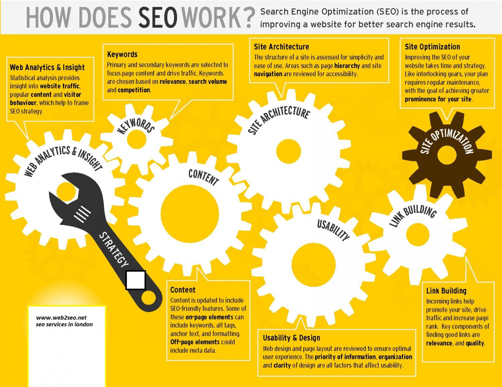

# Learn Search Engine Optimization

> Search engine optimization (SEO) is the process of affecting the visibility of a website or a web page in a search engine's unpaid results &#8212; often referred to as "natural," "organic," or "earned" results. In general, the earlier (or higher ranked on the search results page), and more frequently a site appears in the search results list, the more visitors it will receive from the search engine's users. SEO may target different kinds of search, including image search, local search, video search, academic search, news search and industry-specific vertical search engines.

><cite>&#8212; [Wikipedia](https://en.wikipedia.org/wiki/Search_engine_optimization)</cite>

how-does-seo-work.png

<cite>Image source: <a href="https://visual.ly/community/infographic/computers/how-does-seo-work">https://visual.ly/community/infographic/computers/how-does-seo-work</a></cite>

##### General Learning:

* [Google Search Engine Optimization Starter Guide](http://static.googleusercontent.com/media/www.google.com/en//webmasters/docs/search-engine-optimization-starter-guide.pdf) [read]
* [Modern SEO](https://frontendmasters.com/workshops/modern-seo/) [watch][$]
* [SEO Fundamentals From David Booth](http://www.lynda.com/Analytics-tutorials/SEO-Fundamentals/187858-2.html) [watch][$]
* [SEO Fundamentals From Paul Wilson](http://www.pluralsight.com/courses/seo-fundamentals) [watch][$]
* [SEO Tutorial For Beginners in 2016](http://www.hobo-web.co.uk/seo-tutorial/) [read]
* [SEO for Web Designers](https://webdesign.tutsplus.com/courses/seo-for-web-designers) [watch][$]

 

